# cat-dataset

Slightly improved cat-dataset for use in cat face landmark prediction models. Dataset consists of cat images with face landmarks annotated. It was created with [this project](https://github.com/zylamarek/frederic) in mind.

Dataset originally created by authors of 

[Weiwei Zhang, Jian Sun, and Xiaoou Tang, "Cat Head Detection - How to Effectively Exploit Shape and Texture Features", Proc. of European Conf. Computer Vision, vol. 4, pp.802-816, 2008](https://www.microsoft.com/en-us/research/wp-content/uploads/2008/10/ECCV_CAT_PROC.pdf)

[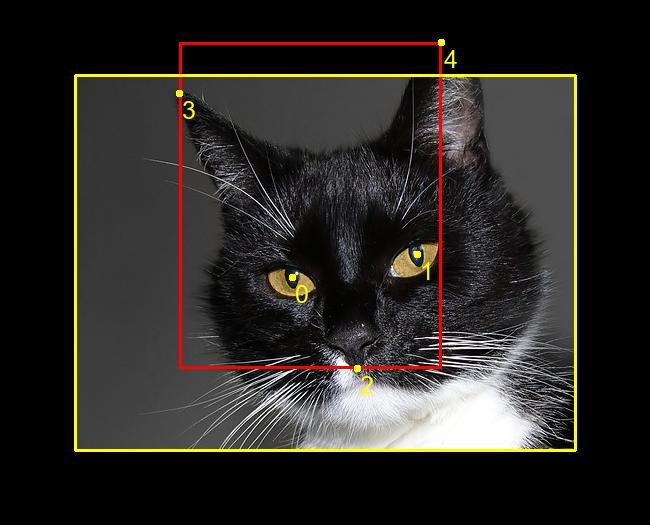](./graphics/CAT_00_00000011_017.jpg)

*One of the images in the dataset. Annotated landmarks are presented as yellow dots
(0 - right eye, 1 - left eye, 2 - mouth, 3 - right ear, 4 - left ear).
Bounding box containing all the landmarks is shown in red.
Yellow rectangle represents the boundaries of the image.*

## Usage

Run
```
python get_dataset.py
```

This will download the original dataset and apply all changes listed below.

I did my best to make this script as independent of any non-standard library as I could.
However, it still requires Pillow to crop images.

## Contribution

I started by removing duplicates. Then I manually removed images not fulfilling requirements:

- there is exactly one cat
- there is exactly one cat face 
- cat face may be occluded, given that it can still be recognized by human
- the cat may be accompanied by its reflection in a mirror/puddle
- the cat may be accompanied by sculptures of cats
- the image must depict a real cat being - images showing pictures of cats or items with a picture of a cat
printed on them do not count as a cat
- the image cannot be manipulated in a way that can be spotted with a human eye

[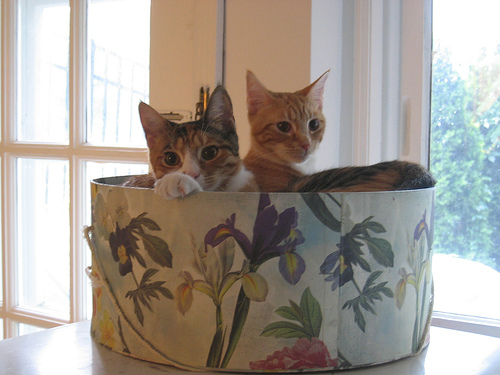](./graphics/CAT_05_00001110_027.jpg)
[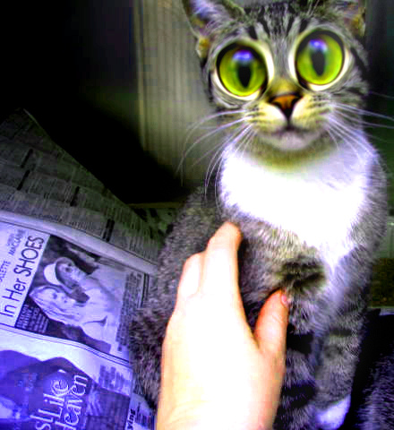](./graphics/CAT_05_00001158_000.jpg)
[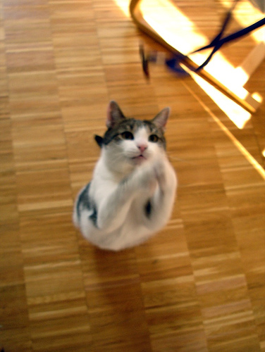](./graphics/CAT_06_00001300_005.jpg)

*Examples of removed images (reasons: multiple cats/manipulated/duplicate).*

I noticed that some particular landmarks are often incorrectly annotated - especially numbers 4, 6, 7 and 9 on the figure below.
I removed these landmarks from all the files.

[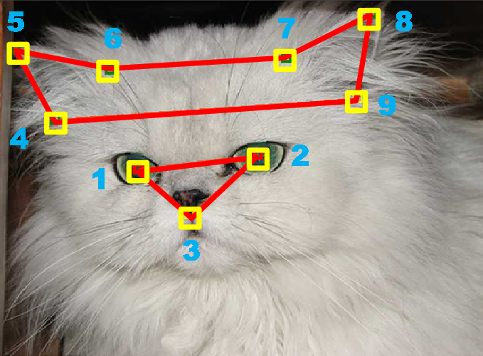](./graphics/annotation_original.png)

*Original annotation used in the cited paper.*

I split the data into training, validation and test sets.
Data in each directory of the original dataset (CAT_00-CAT_06) is slightly correlated (there are multiple pictures of the same cat),
as you can see in the figure below. Therefore I didn't want to mix the data between directories. Instead:
- CAT_00-CAT_04 - training (7008 ~ 73%)
- CAT_05 - validation (1267 ~ 13%)  
- CAT_06 - test (1295 ~ 14%)

[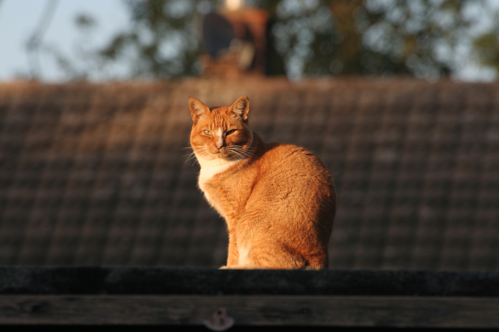](./graphics/00000022_009.jpg)
[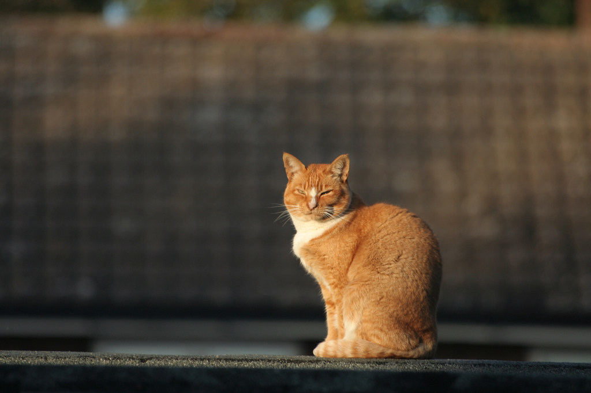](./graphics/00000022_010.jpg)
[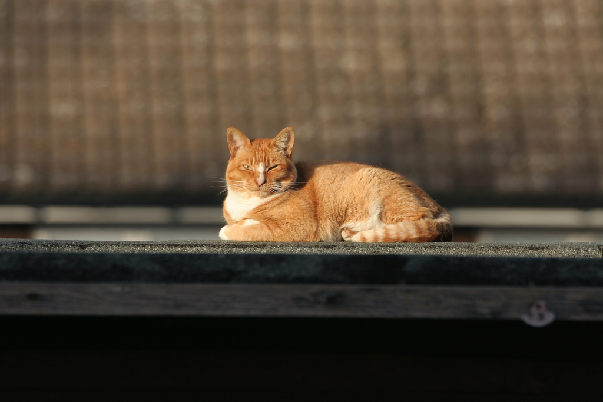](./graphics/00000022_011.jpg)

*Example showing how some images in the original directories are correlated. All these 3 pictures live inside CAT_00 directory.*

To make the testing scale-independent I wanted the scales of the images to be distributed uniformly in the validation
and test datasets. I defined scale as a ratio between the longer bounding box edge and the longer picture edge.
I randomly picked and cropped some images. Figure below shows the distributions before and after cropping.  

[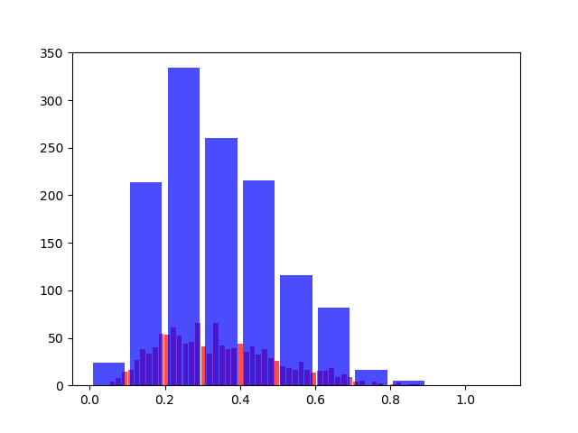](./graphics/CAT_05_before.png)
[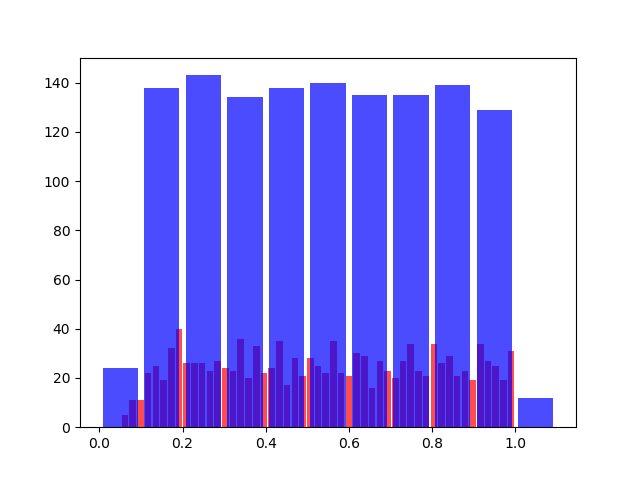](./graphics/CAT_05_after.png)

[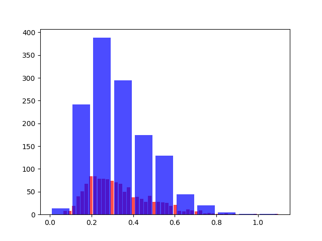](./graphics/CAT_06_before.png)
[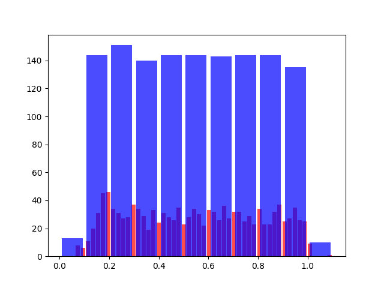](./graphics/CAT_06_after.png)

*Distribution of scales in validation set (top) and test set (bottom) before (left) and after (right) cropping.*

Some algorithms may first predict the bounding box of the cat face and only then predict landmarks on the cropped ROI.
In such case extra validation and test datasets may be used for training the already-cropped landmark prediction model.
I created such datasets by cropping the ground truth bounding box with random margin 0% - 20% on each side separately to simulate errors
made by a bounding box prediction algorithm. After sampling the margins, the new cropping bounding box was extended to make
the resulting image square, while preserving position of the center. If the cropping bounding box extended from the image
it was filled in black.

On top of that I resized all images in the landmark (cropped ROI) validation and test sets to 224x224 with Lanczos sampling,
preserving the aspect ratio
and center of the image, adding black border if necessary. Landmark coordinates were rounded
to the nearest integer. Resized images were saved in BMP format to prevent the JPEG artifacts from affecting the results.

## Links

Archived version of the original dataset webpage:  
<https://web.archive.org/web/20150520175645/http://137.189.35.203/WebUI/CatDatabase/catData.html>

Archived version of the original dataset:  
<https://archive.org/download/CAT_DATASET/CAT_DATASET_01.zip> 
<https://archive.org/download/CAT_DATASET/CAT_DATASET_02.zip>
<https://archive.org/download/CAT_DATASET/00000003_015.jpg.cat>

Dataset can also be found on kaggle:  
<https://www.kaggle.com/crawford/cat-dataset/version/2>
